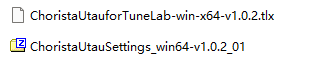
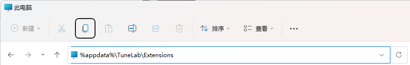

# 安装与卸载与基本输入

## 1.ChoristaUtau Voice Engine插件 

### 1.1 插件安装 

第一步. 到TuneLab Forum或其他适当的位置下载ChoristaUtau For TuneLab插件安装文件。如：

<figure><figcaption></figcaption></figure>

​​第二步.拖动TLX插件安装包（如上图中的ChoristaUtauforTuneLab-win-x64-v1.5.1.tlx)到TuneLab窗口的任意部分。此时鼠标变成拖动状态。鼠标拖放状态

<figure><figcaption></figcaption></figure>

第三步.在TuneLab编辑器窗口松开鼠标，插件会自动安装。当弹出提示：”ChoristaUtau插件已安装成功!“ 时，插件已安装完成。​

### 1.2 插件卸载 

截至1.5.6版本，TuneLab尚未提供独立的“插件管理器”（事实上它已经在开发任务清单中），因此插件的卸载需要手动进行。具体步骤如下：

首先打开“文件管理器”。

<figure><figcaption></figcaption></figure>

文件管理器然后在地址栏输入插件存储目录路径"%appdata%\TuneLab\Extensions"(不包含引号)输入路径

<figure><figcaption></figcaption></figure>

接着按下回车键，即可进入"插件存储目录"插件存储目录内容

最后选择你要删除的插件的文件夹（如ChoristaUtau）,按下回车键删除目录。

<figure><figcaption></figcaption></figure>

即可删除指定插件。请注意：删除插件时必须关闭Tunelab编辑器，不然你会删除失败。​

### 1.3 插件更新 

TuneLab的插件更新是自覆盖安装模式。因此当你需要升级/降级插件时只需要重新执行1.1节的安装步骤即可。

&#x20;需要注意的是，在执行过程中，由于已经安装了旧版本的插件。因此会有一个弹窗询问“插件已经安装过了，是否需要重启编辑器并重新安装插件”，此时选择“是”，编辑器会自动重启并更新插件。

<figure><figcaption></figcaption></figure>

## **2.Utau声库**

### **2.1声库的安装**

Utau声库不需要额外的安装即可使用，具体的配置安装步骤如下：

**2.1.1 设置声库索引目录（一次性）**

首次使用需要配置声库索引目录。配置声库索引目录有两个方法：

**第一种：手动配置**

编辑%USERPROFILE%.TuneLab\ChoristaUtau\voicedirs.txt配置文件，并且在其中写出声库文件夹所在路径。每行一个检索目录。

如果路径或文件不存在，请手动创建

**第二种：使用配置工具配置（WindowsOnly)**

配置工具提供声库的图形界面配置，首先请获得配置工具ChoristaUtauSettings\_win64.zip并在任意路径解压。

然后在解压后的目录中找到SettingBuilder\_win64.exe并执行

<figure><figcaption></figcaption></figure>

接着点击界面中“Add Folder”按钮添加检索路径（如D:\UtauDB)

<figure><figcaption></figcaption></figure>

**2.1.2 安装Utau声库**

复制Utau声库文件夹或解压声库压缩包到刚刚配置的索引目录即可。

<figure><figcaption></figcaption></figure>

### **2.2 卸载声库**

到刚刚配置的索引目录，删除指定声库即可。

### **2.3 清除声库信息缓存**

声库信息缓存（uvoicebank.protobuf)是用于加速声库信息读取和识别的临时文件，当声库信息识别错误或内容发生变更时，编辑器通常会自动检测到变化并且重建缓存。但当缓存未能成功刷新时，往往需要手动清除声库信息缓存。

声库信息缓存的清理有两种方法

**第一种：手动清理**

请到声库的文件夹中手动清除声库信息缓存（uvoicebank.protobuf)。这个文件与character.txt在同一级文件夹中。

**第二种：使用配置工具配置（WindowsOnly)**

配置工具提供声库的图形界面配置，在界面中点击“Clean UVoiceBank.protobuf”按钮即可批量清除声库信息缓存

### 2.4 声库选择 

安装完声库后，直接打开TuneLab编辑器，然后在"片段"上点击鼠标右键，选择"设置声源(Set Voice)"菜单，即可选择引擎(以ChoristaUtau\_开头，如ChoristaUtau\_Mores)并设置所使用的声库到选定的片段。

<figure><figcaption></figcaption></figure>

### 2.5 音素器选择 

Utau的声库往往具备不同的拆音方案，为了适配这个，本插件也支持音素器用于自动拆音。

音素器的选择位置在界面右侧的属性设置区的Phonemizer属性处设置。

目前内置音素器有自建音素器和OpenUtau兼容音素器。

<figure><figcaption></figcaption></figure>

**自建音素器：**

**\*AutoSelect**

自动匹配音素器，音素器内置有检测函数主动判断是否适用于当前声库。如果当前声库在其他Part或者工程中被设置过，那么将使用最后一次设置的音素器。

最后一次设置的音素器被记录在声库文件夹下的phonemizer.txt文件中

**\*Auto CVVC(Presamp.ini)**

CVVC方案音素器，通过读取Presamp.ini来实现CVVC声库拆音。

**\*Auto Mocaloid**

Mocaloid中日语方案音素器，CVVC音素器的变种，用于读取Mocaloid转换器转制的V库。

**\*Japanese Romaji**

罗马音转换音素器，可以输入罗马音解析成日文文字驱动是声库。

**\*Japanese VCV**

日语VCV方案音素器

**\*Whole Word(CV)**

标准整音方案音素器，该音素器是基础音素器。也就是不做任何拆音，将歌词传递给引擎。与Utau.exe的音符输入完全一致

**OpenUtau兼容的其他音素器：**

\[OU]开头的音素器是OpenUtau内置音素器进行适配器编译获得的音素器，基于MIT协议引用。所有代码内容与OpenUtau原版一致。功能和效果也一致。

