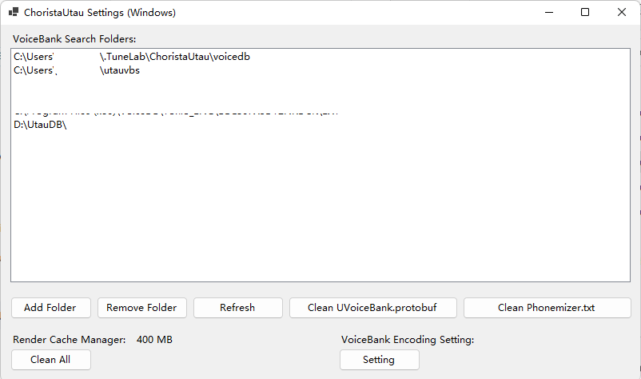
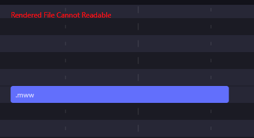

# 缓存管理和常见故障

此节预先准备常见故障的应答

## 1.缓存管理

Utau的高速渲染是依赖缓存的，但是有个别时候缓存的认证错误会导致参数没有应用或者出现其他故障。此时需要清理缓存。

合成缓存的存储目录是%Temp%\ChoristaUtau，但是建议使用图形界面工具清理：

<figure><figcaption></figcaption></figure>

点击RenderCacheManager处的CleanAll即可。

工具的获取方法见“安装与卸载与基本输入”一节。

## 2.采样渲染故障

<figure><figcaption></figcaption></figure>

故障表现如图所示，这个错误出现意味着当前区块的音频渲染失败。

失败通常是两个元音导致的：其一是引擎并发出错，其二是Oto文件不存在。

#### 2.1 引擎并发出错的解决

引擎并发出错往往是系统性能造成的，由于同时高速读写文件，导致系统锁定了Utau渲染引擎，使得渲染失败。

此时只需要重新发起渲染即可，发起的方法有很多，例如：在音高编辑状态下在当前区域右键单击鼠标。

#### 2.2 Prefix.map文件不存在 - 完整性问题

这种情况是Oto内采样文件找不到，导致Resampler未能正确渲染音频导致的。引起的主要原因就是：声库包不完整或者oto编码集不能识别。

此项问题常见于以OpenUtau为载台的多音阶声库。Utau声库中oto的alias设定是有音阶/音色前缀的，这个前缀并不能被默认知道。Utau标准规范使用prefix.map文件定义前缀关系。

如果多音阶声库缺失了prefix.map定义文件，并且引擎也没能分析到音高标识，那么就会找不到音源文件导致故障。

处理方法就是补齐prefix.map

#### 2.3 Oto文件不存在 - 编码问题

这种情况是Oto内采样文件找不到，导致Resampler未能正确渲染音频导致的。引起的主要原因就是：声库包不完整或者oto编码集不能识别。

此时请检查oto内文件与实际文件名是否一致，是否正常找到采样文件。

另外可以尝试使用设置工具指定oto文件编码。通常编码应该为ShiftJIS（Utau默认）

<figure><figcaption></figcaption></figure>

#### 2.4 音素器问题

音素器用于将输入歌词转换为用于合成的发音符号。

当音素器转换出来的符号不存在时会有这个问题。解决方法是：换一个音素器。

测试是否是音素器问题，可以参照"歌词输入"一节的方法直接以英文句号为前缀输入alias符号（如.a或.a_A4）不通过音素器和前缀管理器，直接访问声库（2.2问题也可以这么测试）

如果是音素器问题，更换音素器即可。

常见的情况有：在不支持罗马音转假名的日语音素器上使用罗马音，导致假名音源收到音素是罗马音符号，引起文件找不到的故障。